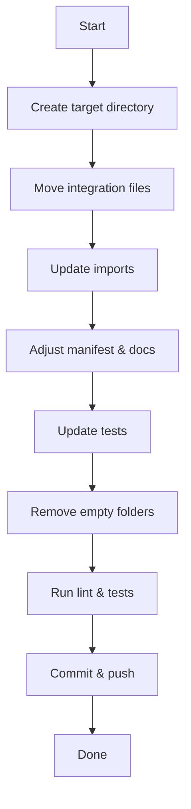

# Refactor Project Folder Structure

## Objective
Reorganize the repository to remove the redundant `openkarotz-ha` top‑level folder and place the Home Assistant integration directly under `custom_components/openkarotz`. This simplifies the layout, aligns with typical HA custom component repositories, and makes the codebase easier to navigate.

## Steps
1. **Create new target directory**
   - `custom_components/openkarotz/` (if it does not already exist).
2. **Move integration files**
   - Relocate all files from `openkarotz-ha/custom_components/openkarotz/` to the new `custom_components/openkarotz/` directory, preserving the internal structure (e.g., `api.py`, `const.py`, `coordinator.py`, `services.py`, `sensors.py`, `lights.py`, `media_player.py`, `binary_sensor.py`, `switch.py`, `translations/`, etc.).
3. **Update import statements**
   - Search for any absolute imports that reference the old path (e.g., `from openkarotz-ha.custom_components.openkarotz...`). Replace them with relative imports appropriate for the new location (e.g., `from .api import OpenKarotzAPI`).
4. **Adjust manifest and configuration files**
   - Move `openkarotz-ha/manifest.json` to the new component root if present, or ensure a `manifest.json` exists in `custom_components/openkarotz/`.
   - Update any paths inside `manifest.json` that reference the old folder.
5. **Update documentation**
   - Edit `README.md` and any other docs to reflect the new repository layout (e.g., installation instructions should point to `custom_components/openkarotz/`).
6. **Update tests**
   - Move test files from `openkarotz-ha/tests/` to `tests/` (or keep under `tests/` at repo root) and adjust import paths accordingly.
7. **Remove empty directories**
   - Delete the now‑empty `openkarotz-ha/custom_components/` and `openkarotz-ha/` directories.
8. **Run linting and tests**
   - Execute the project's test suite to verify that the refactor did not break functionality.
9. **Commit changes**
   - Stage all modifications, create a commit with a clear message (e.g., "Refactor repository layout: move integration to top‑level custom_components"), and push to GitHub.

## Mermaid Diagram (Refactor Flow)


## Notes
- Ensure that no leftover references to `openkarotz-ha` remain; a global search (`search_files` with regex `openkarotz-ha`) can help verify.
- The SSH key files (`id_ed25519.pub`, `id_ed25519.pub.pub`) should remain ignored via `.gitignore` and not be committed.
- After the refactor, the repository will follow the conventional HA custom component layout:
  ```
  custom_components/
  └─ openkarotz/
      ├─ __init__.py
      ├─ api.py
      ├─ const.py
      └─ ...
  ```
