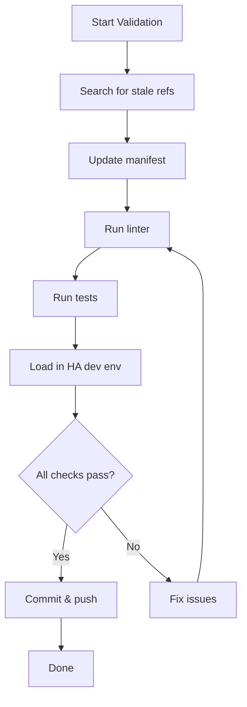

# Validation Plan for Refactored OpenKarotz Integration

## Objectives
- Ensure that the repository layout matches the standard Home Assistant custom component structure.
- Verify that all import statements are correct after moving files.
- Run the project's test suite and linting tools to catch regressions.
- Confirm that the integration can be loaded by Home Assistant without errors.

## Steps
1. **Search for stale references**
   - Use a regex search for `openkarotz-ha` across the repository.
   - Replace any occurrences with the appropriate new path or remove if obsolete.
2. **Update manifest.json**
   - Ensure `manifest.json` resides in `custom_components/openkarotz/`.
   - Verify that the `domain`, `name`, and `codeowners` fields are correct.
3. **Run static analysis**
   - Execute `flake8` (or the project's linter) on the `custom_components/openkarotz/` directory.
   - Fix any style or import errors.
4. **Execute unit tests**
   - Run `pytest` (or the configured test runner) from the repository root.
   - Ensure all tests pass.
5. **Load integration in a Home Assistant dev environment**
   - Start a Home Assistant Docker container with the `custom_components` folder mounted.
   - Check the logs for any import errors or runtime exceptions.
6. **Commit validation results**
   - If all checks pass, stage the changes and commit with a message like `Validate refactor: all imports updated, tests pass`.
   - Push the commit to the remote repository.

## Mermaid Diagram (Validation Workflow)

